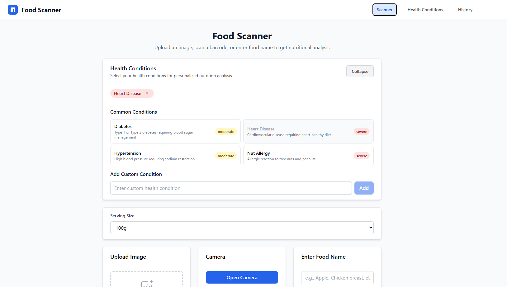

# 🍎 Food Scanning API & Web App

A comprehensive food scanning application that combines **AI-powered image recognition**, **nutrition analysis**, and **personalized health recommendations**. Built with Django REST Framework backend and React TypeScript frontend.



## 🌟 Features

### 🔍 **Smart Food Recognition**
- **Image Recognition**: Upload food photos for instant identification using Google Gemini 1.5 Flash
- **Barcode Scanning**: Scan packaged food barcodes for accurate product identification
- **Manual Input**: Text-based food entry with intelligent matching

### 📊 **Comprehensive Nutrition Analysis**
- **Hybrid Database System**: Local database with AI fallback for unlimited food variety
- **Detailed Nutrition Profiles**: Macros, micros, vitamins, minerals, and health scores
- **Multiple Data Sources**: Database, Open Food Facts, AI estimation with source tracking
- **Nutri-Score & Glycemic Index**: European nutrition scoring and blood sugar impact

### 🏥 **Personalized Health Analysis**
- **10+ Health Conditions**: Diabetes, Hypertension, Heart Disease, Celiac, Kidney Disease, GERD, and more
- **Dynamic Restrictions**: JSON-based dietary limits (max sodium, sugar, etc.)
- **Intelligent Scoring**: 0-10 health compatibility score with severity levels
- **Contextual Recommendations**: Condition-specific advice and alternatives

### 📱 **Modern Web Interface**
- **Responsive Design**: Works seamlessly on desktop and mobile
- **Real-time Analysis**: Instant nutrition and health feedback
- **Scan History**: Track your food choices and health trends
- **Health Dashboard**: Monitor compliance with dietary restrictions

### 🔧 **Developer Features**
- **RESTful API**: Complete OpenAPI/Swagger documentation
- **Modular Architecture**: Extensible services for food identification, nutrition analysis, and health assessment
- **Multiple LLM Providers**: Support for Gemini, OpenAI, Anthropic with easy switching
- **Docker Support**: Containerized deployment ready

## 🏗️ Architecture

```
┌─────────────────┐    ┌──────────────────┐    ┌─────────────────┐
│   React Frontend │    │  Django Backend  │    │  External APIs  │
│                 │    │                  │    │                 │
│ • Food Scanner  │◄──►│ • REST API       │◄──►│ • Google Gemini │
│ • Health Dash   │    │ • Services Layer │    │ • Open Food     │
│ • Scan History  │    │ • Database       │    │ • Future: More  │
└─────────────────┘    └──────────────────┘    └─────────────────┘
```

### 🧠 **AI-Powered Services**
- **FoodIdentificationService**: Image-to-food-name using advanced vision models
- **NutritionAnalyzerService**: Hybrid DB+AI nutrition data with learning capability
- **HealthAnalyzerService**: Personalized health analysis with condition-specific logic

## 🚀 Quick Start

### Prerequisites
- **Python 3.9+**
- **Node.js 16+**
- **Git**

### 1. Clone Repository
```bash
git clone https://github.com/yourusername/food-scanning-app.git
cd food-scanning-app
```

### 2. Backend Setup
```bash
cd backend

# Create virtual environment
python -m venv venv
source venv/bin/activate  # On Windows: venv\Scripts\activate

# Install dependencies
pip install -r requirements.txt

# Environment setup
cp .env.example .env
# Edit .env with your API keys (see Configuration section)

# Database setup
python manage.py migrate
python manage.py populate_health_conditions  # Load health conditions
python manage.py populate_sample_foods       # Load sample food database

# Run development server
python manage.py runserver
```

### 3. Frontend Setup
```bash
cd frontend

# Install dependencies
npm install

# Start development server
npm start
```

### 4. Access Application
- **Frontend**: http://localhost:3000
- **Backend API**: http://127.0.0.1:8000
- **API Documentation**: http://127.0.0.1:8000/swagger/

## ⚙️ Configuration

### Environment Variables (.env)
```bash
# Django Settings
SECRET_KEY=your-secret-key-here
DEBUG=True
ALLOWED_HOSTS=localhost,127.0.0.1

# Database (SQLite by default, PostgreSQL for production)
DATABASE_URL=sqlite:///db.sqlite3

# LLM Provider Configuration
LLM_PROVIDER=gemini  # Options: gemini, openai, anthropic
GEMINI_API_KEY=your-gemini-api-key
OPENAI_API_KEY=your-openai-api-key  # Optional
ANTHROPIC_API_KEY=your-anthropic-api-key  # Optional

# External APIs
OPEN_FOOD_FACTS_API_URL=https://world.openfoodfacts.org/api/v0

# CORS Settings
CORS_ALLOWED_ORIGINS=http://localhost:3000,http://127.0.0.1:3000
```

### Getting API Keys

#### Google Gemini (Primary)
1. Visit [Google AI Studio](https://makersuite.google.com/app/apikey)
2. Create a new API key
3. Add to `.env` as `GEMINI_API_KEY`

#### OpenAI (Optional)
1. Visit [OpenAI Platform](https://platform.openai.com/api-keys)
2. Create API key
3. Add to `.env` as `OPENAI_API_KEY`

## 📖 API Documentation

### Core Endpoints

#### Food Identification
```http
POST /api/identify-food/
Content-Type: multipart/form-data

{
  "image": <file>,
  "additional_context": "optional context"
}
```

#### Comprehensive Food Analysis
```http
POST /api/scan/
Content-Type: multipart/form-data

{
  "food_name": "apple",           # OR
  "barcode": "1234567890",        # OR  
  "image": <file>,                # One of these required
  
  "serving_size": "1 medium",     # Optional
  "health_conditions": [          # Optional
    "Diabetes",
    "Hypertension"
  ]
}
```

#### Health Conditions
```http
GET /api/health-conditions/
```

#### Scan History
```http
GET /api/scan-history/
```

### Response Format
```json
{
  "food_name": "Red Apple",
  "confidence": 0.95,
  "macros": {
    "calories": 95,
    "protein_g": 0.5,
    "carbohydrates_g": 25,
    "fat_g": 0.3,
    "fiber_g": 4.4
  },
  "health_analysis": {
    "overall_score": 8.5,
    "remarks": [
      {
        "condition": "Diabetes",
        "severity": "info",
        "message": "Low glycemic index food - good for blood sugar control",
        "recommendation": "Excellent choice for diabetes management"
      }
    ]
  },
  "source": "Database",
  "scan_id": "uuid-here"
}
```

## 🏥 Health Conditions

The system supports comprehensive analysis for:

| Condition | Key Restrictions | Nutritional Targets |
|-----------|------------------|-------------------|
| **Diabetes** | Max sugar: 25g, Max carbs: 45g | Min fiber: 8g, Max sodium: 2000mg |
| **Hypertension** | Max sodium: 1500mg | Min potassium: 400mg, Min magnesium: 80mg |
| **Heart Disease** | Max saturated fat: 5g | Min omega-3: 250mg, Min fiber: 10g |
| **Celiac Disease** | Gluten-free ingredients | Min iron: 8mg, Min folate: 200mcg |
| **Kidney Disease** | Max protein: 20g, Max potassium: 600mg | Controlled phosphorus: <200mg |
| **GERD** | Avoid acidic/spicy foods | Low fat: <10g per serving |
| **High Cholesterol** | Max cholesterol: 200mg | Min fiber: 10g, Plant sterols preferred |
| **Lactose Intolerance** | Dairy-free ingredients | Min calcium: 300mg (alternatives) |
| **Iron Deficiency** | Avoid iron inhibitors | Min iron: 6mg, Min vitamin C: 30mg |
| **Osteoporosis** | Limit sodium/caffeine | Min calcium: 400mg, Min vitamin D: 200 IU |

## 🛠️ Development

### Project Structure
```
food-scanning-app/
├── backend/                 # Django REST API
│   ├── food_scanner/       # Main app
│   │   ├── models.py       # Database models
│   │   ├── views.py        # API endpoints
│   │   ├── services/       # Business logic
│   │   │   ├── food_identification.py
│   │   │   ├── nutrition_analyzer.py
│   │   │   ├── health_analyzer.py
│   │   │   └── llm_service.py
│   │   └── management/     # Django commands
│   └── requirements.txt
├── frontend/               # React TypeScript app
│   ├── src/
│   │   ├── components/     # React components
│   │   ├── services/       # API integration
│   │   └── types/          # TypeScript definitions
│   └── package.json
├── docs/                   # Documentation
├── docker-compose.yml      # Container orchestration
└── README.md
```

### Adding New Health Conditions
```python
# In populate_health_conditions.py
{
    'name': 'New Condition',
    'description': 'Condition description',
    'severity': 'moderate',
    'dietary_restrictions': {
        'max_nutrient_g': 50,
        'avoid_ingredients': ['ingredient1', 'ingredient2']
    },
    'nutritional_targets': {
        'min_nutrient_g': 10,
        'preferred_nutrients': ['fiber', 'protein']
    },
    'warning_template': 'Warning message template',
    'recommendation_template': 'Recommendation template'
}
```

### Extending LLM Providers
```python
# In llm_service.py
class NewLLMProvider:
    def identify_food(self, image_data, prompt):
        # Implementation
        return food_name
    
    def estimate_nutrition(self, food_name):
        # Implementation  
        return nutrition_data
```

## 🐳 Docker Deployment

### Development
```bash
docker-compose up --build
```

### Production
```bash
docker-compose -f docker-compose.prod.yml up -d
```

## 🧪 Testing

### Backend Tests
```bash
cd backend
python manage.py test
```

### Frontend Tests
```bash
cd frontend
npm test
```

### API Testing
```bash
# Test food identification
curl -X POST http://localhost:8000/api/identify-food/ \
  -F "image=@test_images/apple.jpg"

# Test comprehensive scan
curl -X POST http://localhost:8000/api/scan/ \
  -F "food_name=apple" \
  -F "health_conditions=[\"Diabetes\"]"
```

## 📊 Performance & Scalability

- **Database-First Architecture**: Fast queries with AI fallback
- **Intelligent Caching**: Health conditions and frequent foods cached
- **Async Processing**: Non-blocking AI requests
- **Horizontal Scaling**: Stateless services ready for load balancing
- **CDN Ready**: Static assets optimized for global delivery

## 🔒 Security

- **API Key Management**: Environment-based configuration
- **Input Validation**: Comprehensive request sanitization
- **CORS Configuration**: Controlled cross-origin access
- **Rate Limiting**: API abuse prevention (production)
- **Data Privacy**: No personal health data stored without consent

## 🤝 Contributing

1. **Fork the repository**
2. **Create feature branch**: `git checkout -b feature/amazing-feature`
3. **Commit changes**: `git commit -m 'Add amazing feature'`
4. **Push to branch**: `git push origin feature/amazing-feature`
5. **Open Pull Request**

### Development Guidelines
- Follow PEP 8 for Python code
- Use TypeScript for all frontend code
- Add tests for new features
- Update documentation for API changes
- Follow conventional commit messages

## 📄 License

This project is licensed under the MIT License - see the [LICENSE](LICENSE) file for details.

## 🙏 Acknowledgments

- **Google Gemini**: AI-powered food recognition
- **Open Food Facts**: Comprehensive food database
- **Django REST Framework**: Robust API foundation
- **React**: Modern frontend framework
- **TypeScript**: Type-safe development

## 📞 Support

- **Issues**: [GitHub Issues](https://github.com/yourusername/food-scanning-app/issues)
- **Discussions**: [GitHub Discussions](https://github.com/yourusername/food-scanning-app/discussions)
- **Email**: your-email@example.com

---

**Built with ❤️ for healthier eating and better nutrition awareness**
